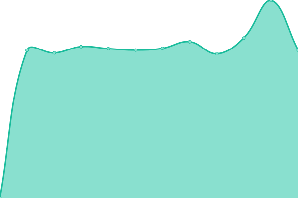

# [📈 Live Status](https://snowdreams1006.github.io/monitor.snowdreams1006.cn): <!--live status--> **🟧 Partial outage**

This repository contains the open-source uptime monitor and status page for [snowdreams1006](https://snowdreams1006.github.io/), powered by [Upptime](https://github.com/upptime/upptime).

With [Upptime](https://upptime.js.org), you can get your own unlimited and free uptime monitor and status page, powered entirely by a GitHub repository. We use [Issues](https://github.com/snowdreams1006/monitor.snowdreams1006.cn/issues) as incident reports, [Actions](https://github.com/snowdreams1006/monitor.snowdreams1006.cn/actions) as uptime monitors, and [Pages](https://snowdreams1006.github.io/monitor.snowdreams1006.cn) for the status page.

<!--start: status pages-->
<!-- This summary is generated by Upptime (https://github.com/upptime/upptime) -->
<!-- Do not edit this manually, your changes will be overwritten -->
<!-- prettier-ignore -->
| URL | Status | History | Response Time | Uptime |
| --- | ------ | ------- | ------------- | ------ |
|  [blog](https://blog.snowdreams1006.cn) | 🟩 Up | [blog.yml](https://github.com/snowdreams1006/monitor/commits/HEAD/history/blog.yml) | 

 2018ms
     
 | 

<a href="https://snowdreams1006.github.io/monitor/history/blog">100.00%</a>
    

|  [tools](https://tools.snowdreams1006.cn) | 🟩 Up | [tools.yml](https://github.com/snowdreams1006/monitor/commits/HEAD/history/tools.yml) | 

 1188ms
     
 | 

<a href="https://snowdreams1006.github.io/monitor/history/tools">100.00%</a>
    

|  [easy](https://easy.snowdreams1006.cn) | 🟥 Down | [easy.yml](https://github.com/snowdreams1006/monitor/commits/HEAD/history/easy.yml) | 

 1277ms
     
 | 

<a href="https://snowdreams1006.github.io/monitor/history/easy">0.00%</a>
    

|  [regex](https://regex.snowdreams1006.cn) | 🟩 Up | [regex.yml](https://github.com/snowdreams1006/monitor/commits/HEAD/history/regex.yml) | 

 1218ms
     
 | 

<a href="https://snowdreams1006.github.io/monitor/history/regex">100.00%</a>
    

|  [regex-docs](https://regex-docs.snowdreams1006.cn) | 🟩 Up | [regex-docs.yml](https://github.com/snowdreams1006/monitor/commits/HEAD/history/regex-docs.yml) | 

 1347ms
     
 | 

<a href="https://snowdreams1006.github.io/monitor/history/regex-docs">100.00%</a>
    

|  [mermaid-editor](https://mermaid-editor.snowdreams1006.cn) | 🟩 Up | [mermaid-editor.yml](https://github.com/snowdreams1006/monitor/commits/HEAD/history/mermaid-editor.yml) | 

 1332ms
     
 | 

<a href="https://snowdreams1006.github.io/monitor/history/mermaid-editor">100.00%</a>
    

|  [bark](https://bark.snowdreams1006.cn) | 🟩 Up | [bark.yml](https://github.com/snowdreams1006/monitor/commits/HEAD/history/bark.yml) | 

 1155ms
     
 | 

<a href="https://snowdreams1006.github.io/monitor/history/bark">100.00%</a>
    

|  [webhook](https://webhook.snowdreams1006.cn) | 🟩 Up | [webhook.yml](https://github.com/snowdreams1006/monitor/commits/HEAD/history/webhook.yml) | 

 1144ms
     
 | 

<a href="https://snowdreams1006.github.io/monitor/history/webhook">100.00%</a>
    

|  [gotify](https://gotify.snowdreams1006.cn/#/) | 🟩 Up | [gotify.yml](https://github.com/snowdreams1006/monitor/commits/HEAD/history/gotify.yml) | 

 1263ms
     
 | 

<a href="https://snowdreams1006.github.io/monitor/history/gotify">100.00%</a>
    

|  Secret Site | 🟩 Up | [secret-site.yml](https://github.com/snowdreams1006/monitor/commits/HEAD/history/secret-site.yml) | 

 1958ms
     
 | 

<a href="https://snowdreams1006.github.io/monitor/history/secret-site">100.00%</a>
    

|  [js56](https://js56.cn/) | 🟩 Up | [js56.yml](https://github.com/snowdreams1006/monitor/commits/HEAD/history/js56.yml) | 

 2122ms
     
 | 

<a href="https://snowdreams1006.github.io/monitor/history/js56">93.38%</a>
    

|  [e6yun](https://login.e6yun.com/Home/Index) | 🟩 Up | [e6yun.yml](https://github.com/snowdreams1006/monitor/commits/HEAD/history/e6yun.yml) | 

 966ms
     
 | 

<a href="https://snowdreams1006.github.io/monitor/history/e6yun">100.00%</a>
    

|  [huoyunren](https://gas.huoyunren.com/index.php?m=login&f=index) | 🟩 Up | [huoyunren.yml](https://github.com/snowdreams1006/monitor/commits/HEAD/history/huoyunren.yml) | 

 1174ms
     
 | 

<a href="https://snowdreams1006.github.io/monitor/history/huoyunren">100.00%</a>
    

|  [zjetc](https://www.zjetc.net/login.html) | 🟩 Up | [zjetc.yml](https://github.com/snowdreams1006/monitor/commits/HEAD/history/zjetc.yml) | 

 1340ms
     
 | 

<a href="https://snowdreams1006.github.io/monitor/history/zjetc">100.00%</a>
    

|  [maersk](https://www.maersk.com.cn/portaluser/login) | 🟩 Up | [maersk.yml](https://github.com/snowdreams1006/monitor/commits/HEAD/history/maersk.yml) | 

 987ms
     
 | 

<a href="https://snowdreams1006.github.io/monitor/history/maersk">100.00%</a>
    

|  [eporthub](http://www.eporthub.com/login?target=http://www.eporthub.com/) | 🟩 Up | [eporthub.yml](https://github.com/snowdreams1006/monitor/commits/HEAD/history/eporthub.yml) | 

 1946ms
     
 | 

<a href="https://snowdreams1006.github.io/monitor/history/eporthub">100.00%</a>
    

|  [epanasia](https://truck.epanasia.com/truck-portal/home) | 🟩 Up | [epanasia.yml](https://github.com/snowdreams1006/monitor/commits/HEAD/history/epanasia.yml) | 

 1086ms
     
 | 

<a href="https://snowdreams1006.github.io/monitor/history/epanasia">100.00%</a>
    

|  [coscoshipping](https://elines.coscoshipping.com/ebusiness/) | 🟩 Up | [coscoshipping.yml](https://github.com/snowdreams1006/monitor/commits/HEAD/history/coscoshipping.yml) | 

 954ms
     
 | 

<a href="https://snowdreams1006.github.io/monitor/history/coscoshipping">100.00%</a>
    

|  [cmict](http://willport.cmict.net/Pages/%E5%85%AC%E5%85%B1%E6%8A%A5%E8%A1%A8/%E5%8D%95%E7%AE%B1%E4%BF%A1%E6%81%AF%E6%9F%A5%E8%AF%A2.aspx) | 🟩 Up | [cmict.yml](https://github.com/snowdreams1006/monitor/commits/HEAD/history/cmict.yml) | 

 2330ms
     
 | 

<a href="https://snowdreams1006.github.io/monitor/history/cmict">99.82%</a>
    

<!--end: status pages-->

[**Visit our status website →**](https://snowdreams1006.github.io/monitor)

## 📄 License

- Powered by: [Upptime](https://github.com/upptime/upptime)
- Code: [MIT](./LICENSE) © [snowdreams1006](https://snowdreams1006.github.io/)
- Data in the `./history` directory: [Open Database License](https://opendatacommons.org/licenses/odbl/1-0/)
